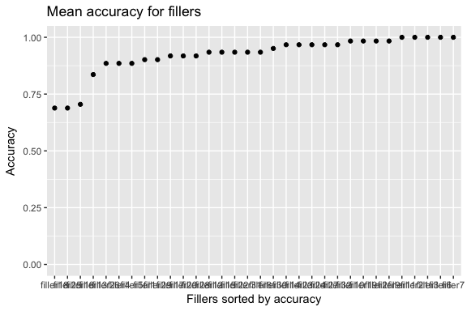
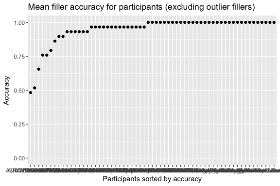
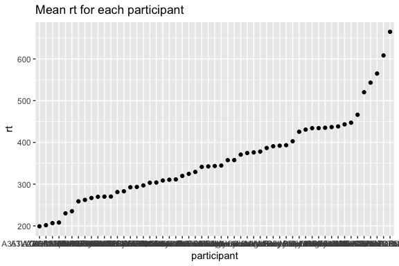
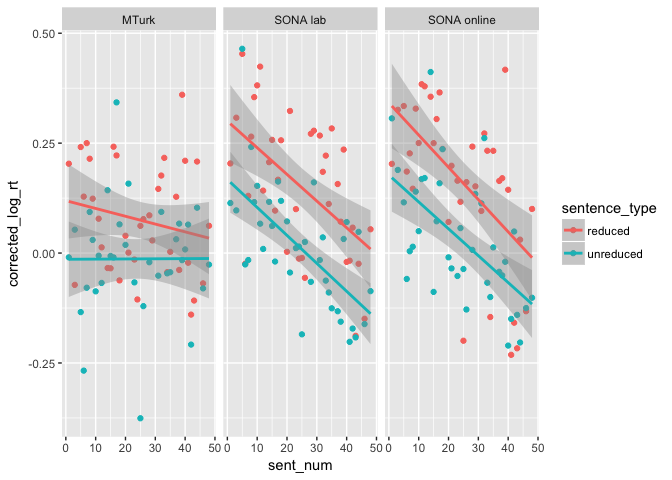

SPR methods: Power analyses
================

### Set up

**Defining some functions**

``` r
#Used to get the mean and sd of any dependent variable in a df as grouped by specific independent variables
data_summary <- function(data, varname, groupnames){
  require(plyr)
   length2 <- function (x, na.rm=FALSE) {
        if (na.rm) sum(!is.na(x))
        else       length(x)
    }
  summary_func <- function(x, col){
    c(N    = length2(x[[col]], na.rm=TRUE),
      mean = mean(x[[col]], na.rm=TRUE),
      sd = sd(x[[col]], na.rm=TRUE))
  }
  data_sum<-ddply(data, groupnames, .fun=summary_func,
                  varname)
  data_sum <- rename(data_sum, c("mean" = varname))
  
  data_sum$se <- data_sum$sd / sqrt(data_sum$N)

  ciMult <- qt(0.95/2 + .5, data_sum$N-1)
  data_sum$ci <- data_sum$se * ciMult
 return(data_sum)
}

data_summ <- function(data, varname, groupnames){
  require(plyr)
   length2 <- function (x, na.rm=FALSE) {
        if (na.rm) sum(!is.na(x))
        else       length(x)
    }
  summary_func <- function(x, col){
    c(N    = length2(x[[col]], na.rm=TRUE),
      mean = mean(x[[col]], na.rm=TRUE),
      sd = sd(x[[col]], na.rm=TRUE))
  }
  data_sum<-ddply(data, groupnames, .fun=summary_func,
                  varname)
  data_sum <- rename(data_sum, c("mean" = varname))
 return(data_sum)
}


filter_data <- function(d, filt_var, filt_val){
  m <- mean(d[[filt_var]])
  s <- sd(d[[filt_var]])
  subset(d, d[[filt_var]] > m-(filt_val*s) & d[[filt_var]] < m+(filt_val*s))
}

plot_regions <- function(d,x_val,y_val,group_val) {
  ggplot(data=d,
       aes_string(x=x_val, y=y_val, colour=group_val, group = group_val)) + geom_point() + geom_line()
}

get_diff <- function(d,colname_var, var1, var2, colname_val, new_colname) {
  data_var1 <- subset(d, d[[colname_var]]==var1)
  data_var2 <- subset(d, d[[colname_var]]==var2)
  new <- data_var1
  new[[new_colname]] <- data_var1[[colname_val]] - data_var2[[colname_val]]
  return(new)
}

c. <- function (x) scale(x, scale = FALSE)
```

``` r
mturk <- read.csv('../Data/mturk.csv', header = TRUE)
mturk$modality <- "MTurk"
mturk_demographic <- read.csv('../Data/mturk_demographic.csv', header = TRUE)
mturk_demographic$modality <- "MTurk"


sona_lab <- read.csv('../Data/sona_lab.csv', header = TRUE)
sona_lab$modality <- "SONA lab"
sona_lab_demographic <- read.csv('../Data/sona_lab_demographic.csv', header = TRUE)
sona_lab_demographic$modality <- "SONA lab"

sona_online <- read.csv('../Data/sona_online.csv', header = TRUE)
sona_online$modality <- "SONA online"
sona_online_demographic <- read.csv('../Data/sona_online_demographic.csv', header = TRUE)
sona_online_demographic$modality <- "SONA online"

spr <- rbind(mturk, sona_lab, sona_online)
spr$word_length <- nchar(as.character(spr$word))
demographic <- rbind(mturk_demographic, sona_lab_demographic, sona_online_demographic)

colnames(demographic) <- c('firstlang_eng', 'first_lang', 'other_langs', 'gender', 'age', 'age_acquisition', 'country', 'participant', 'proficiency', 'education')
```

``` r
# Exclude non-native speakers
native <- subset(spr, trimws(as.character(participant)) %in% trimws(as.character(demographic[demographic$firstlang_eng != 'No',]$participant)))

# Get accuracy of all filler items
fillers <- subset(native, sentence_type == 'filler')
mean_accs_fillers_byitem <- ddply(fillers, .(sent_id), function(x) mean(x$response, na.rm=T))

mean_accs_fillers_byitem$sent_id <- factor(mean_accs_fillers_byitem$sent_id, levels = unique(mean_accs_fillers_byitem$sent_id[order(mean_accs_fillers_byitem$V1)])) #reordering by accuracy

ggplot(mean_accs_fillers_byitem,aes(x=sent_id, y=V1)) + geom_point() + labs(title = 'Mean accuracy for fillers', x = 'Fillers sorted by accuracy', y = 'Accuracy') + ylim(0, 1)
```



``` r
# Get IDs of outliers that have accuracy below 2sd
outliers <- unique(subset(mean_accs_fillers_byitem, V1 < mean(mean_accs_fillers_byitem$V1) - (2*sd(mean_accs_fillers_byitem$V1)))$sent_id)
length(outliers)
```

    ## [1] 3

``` r
# Get mean accuracy for each participant excluding the outlier items
mean_accs_fillers_byparticipant <- ddply(subset(fillers, !(sent_id %in% outliers)), .(participant,list), function(x) mean(x$response, na.rm=T))

mean_accs_fillers_byparticipant$participant <- factor(mean_accs_fillers_byparticipant$participant, levels = unique(mean_accs_fillers_byparticipant$participant[order(mean_accs_fillers_byparticipant$V1)])) #reordering by accuracy

ggplot(mean_accs_fillers_byparticipant,aes(x=participant, y=V1)) + geom_point() + labs(title = 'Mean filler accuracy for participants (excluding outlier fillers)', x = 'Participants sorted by accuracy', y = 'Accuracy') + ylim(0, 1)
```



``` r
# Exclude participants with accuracy less than 0.8
exclusion_value <- min(mean(mean_accs_fillers_byparticipant$V1) - 2*sd(mean_accs_fillers_byparticipant$V1), 0.8)


accurate <- subset(native, participant %in% mean_accs_fillers_byparticipant[mean_accs_fillers_byparticipant$V1 > 0.8,]$participant)
accurate$region <- trimws(accurate$region)
accurate$sentence <- trimws(accurate$sentence)

# Exclude observations with RTs less than 100 and greater than 2000 ms
no_questions <- subset(accurate, is.na(accurate$response))
no_outliers <- subset(no_questions, rt > 100 & rt < 2000)

# Length correction
mixed_model <- lmer(log(rt) ~ scale(word_length) + (1+scale(word_length)|participant), no_outliers)
no_outliers$corrected_log_rt <- residuals(mixed_model)

mean_rt_bypart <- data_summary(no_outliers, 'rt', 'participant')
mean_rt_bypart$participant <- factor(mean_rt_bypart$participant, levels = unique(mean_rt_bypart$participant[order(mean_rt_bypart$rt)]))
ggplot(mean_rt_bypart,aes(x=participant, y=rt)) + geom_point() + labs(title = 'Mean rt for each participant')
```



``` r
slow_parts <- subset(mean_rt_bypart, rt > mean(mean_rt_bypart$rt) + 3*sd(mean_rt_bypart$rt))

no_slow_parts <- subset(no_outliers, !(participant %in% unique(slow_parts$participant)))
```

``` r
length(unique(subset(no_slow_parts, modality == 'MTurk')$participant))
```

    ## [1] 17

``` r
length(unique(subset(no_slow_parts, modality == 'SONA lab')$participant))
```

    ## [1] 19

``` r
length(unique(subset(no_slow_parts, modality == 'SONA online')$participant))
```

    ## [1] 18

``` r
by_sentnum <- data_summary(subset(no_slow_parts, region == 'Disambig_region'), 'corrected_log_rt', groupnames = c('sentence_type', 'modality', 'sent_num'))

ggplot(by_sentnum, aes(sent_num, corrected_log_rt, group = sentence_type, colour = sentence_type)) + geom_point() + geom_smooth(method=lm) + facet_wrap(~modality)
```



### Model

``` r
disambig <- subset(no_slow_parts, region == "Disambig_region")
disambig_summary <- data_summ(disambig, 'corrected_log_rt', groupnames = c('sentence_type', 'participant', 'sent_id', 'modality', 'sent_num'))

#disambig_summary <- data_summ(disambig, 'rt', groupnames = c('sentence_type', 'participant', 'sent_id', 'modality', 'sent_num'))

disambig_summary$sent_id_unique <- factor(str_split_fixed(disambig_summary$sent_id, '_', 2)[,1])

disambig_summary$modality <- factor(disambig_summary$modality, levels = c("MTurk", "SONA online", "SONA lab"))
contrasts(disambig_summary$modality) <- "contr.sum"
contrasts(disambig_summary$modality)
```

    ##             [,1] [,2]
    ## MTurk          1    0
    ## SONA online    0    1
    ## SONA lab      -1   -1

``` r
disambig_summary$sentence_type <- factor(disambig_summary$sentence_type,levels = c('reduced', 'unreduced'))
contrasts(disambig_summary$sentence_type) <- "contr.sum"
contrasts(disambig_summary$sentence_type)
```

    ##           [,1]
    ## reduced      1
    ## unreduced   -1

``` r
model1 <- lmer(corrected_log_rt ~ sentence_type * modality * c.(log(sent_num)) + (1 + sentence_type + c.(log(sent_num)) | participant) + (1 + sentence_type | sent_id_unique), disambig_summary)

print(coef(summary(model1)), digits = 2)
```

    ##                                            Estimate Std. Error  df t value
    ## (Intercept)                                  0.0759     0.0235  17    3.23
    ## sentence_type1                               0.0615     0.0098  17    6.28
    ## modality1                                   -0.0429     0.0136  52   -3.15
    ## modality2                                    0.0406     0.0134  52    3.03
    ## c.(log(sent_num))                           -0.0684     0.0091  56   -7.51
    ## sentence_type1:modality1                    -0.0170     0.0112  74   -1.52
    ## sentence_type1:modality2                     0.0093     0.0110  74    0.84
    ## sentence_type1:c.(log(sent_num))            -0.0012     0.0069 625   -0.18
    ## modality1:c.(log(sent_num))                  0.0388     0.0127  50    3.05
    ## modality2:c.(log(sent_num))                 -0.0273     0.0125  50   -2.18
    ## sentence_type1:modality1:c.(log(sent_num))  -0.0083     0.0097 777   -0.86
    ## sentence_type1:modality2:c.(log(sent_num))   0.0114     0.0095 759    1.20
    ##                                            Pr(>|t|)
    ## (Intercept)                                 4.9e-03
    ## sentence_type1                              9.3e-06
    ## modality1                                   2.7e-03
    ## modality2                                   3.8e-03
    ## c.(log(sent_num))                           5.3e-10
    ## sentence_type1:modality1                    1.3e-01
    ## sentence_type1:modality2                    4.0e-01
    ## sentence_type1:c.(log(sent_num))            8.6e-01
    ## modality1:c.(log(sent_num))                 3.6e-03
    ## modality2:c.(log(sent_num))                 3.4e-02
    ## sentence_type1:modality1:c.(log(sent_num))  3.9e-01
    ## sentence_type1:modality2:c.(log(sent_num))  2.3e-01

``` r
summary(model1)
```

    ## Linear mixed model fit by REML. t-tests use Satterthwaite's method [
    ## lmerModLmerTest]
    ## Formula: 
    ## corrected_log_rt ~ sentence_type * modality * c.(log(sent_num)) +  
    ##     (1 + sentence_type + c.(log(sent_num)) | participant) + (1 +  
    ##     sentence_type | sent_id_unique)
    ##    Data: disambig_summary
    ## 
    ## REML criterion at convergence: -185.7
    ## 
    ## Scaled residuals: 
    ##     Min      1Q  Median      3Q     Max 
    ## -3.7040 -0.5560 -0.0667  0.5108  4.2587 
    ## 
    ## Random effects:
    ##  Groups         Name              Variance  Std.Dev. Corr       
    ##  participant    (Intercept)       0.0024803 0.04980             
    ##                 sentence_type1    0.0008711 0.02952   0.99      
    ##                 c.(log(sent_num)) 0.0019148 0.04376  -0.09  0.07
    ##  sent_id_unique (Intercept)       0.0074128 0.08610             
    ##                 sentence_type1    0.0005603 0.02367  0.69       
    ##  Residual                         0.0374635 0.19355             
    ## Number of obs: 864, groups:  participant, 54; sent_id_unique, 16
    ## 
    ## Fixed effects:
    ##                                              Estimate Std. Error
    ## (Intercept)                                  0.075867   0.023523
    ## sentence_type1                               0.061478   0.009791
    ## modality1                                   -0.042924   0.013605
    ## modality2                                    0.040609   0.013401
    ## c.(log(sent_num))                           -0.068446   0.009118
    ## sentence_type1:modality1                    -0.016987   0.011180
    ## sentence_type1:modality2                     0.009263   0.011000
    ## sentence_type1:c.(log(sent_num))            -0.001208   0.006892
    ## modality1:c.(log(sent_num))                  0.038850   0.012728
    ## modality2:c.(log(sent_num))                 -0.027286   0.012491
    ## sentence_type1:modality1:c.(log(sent_num))  -0.008318   0.009671
    ## sentence_type1:modality2:c.(log(sent_num))   0.011413   0.009544
    ##                                                    df t value Pr(>|t|)    
    ## (Intercept)                                 17.266408   3.225  0.00489 ** 
    ## sentence_type1                              16.579843   6.279 9.33e-06 ***
    ## modality1                                   52.457086  -3.155  0.00266 ** 
    ## modality2                                   52.295638   3.030  0.00379 ** 
    ## c.(log(sent_num))                           55.526983  -7.506 5.29e-10 ***
    ## sentence_type1:modality1                    73.923739  -1.519  0.13293    
    ## sentence_type1:modality2                    73.651468   0.842  0.40245    
    ## sentence_type1:c.(log(sent_num))           625.073590  -0.175  0.86093    
    ## modality1:c.(log(sent_num))                 50.415569   3.052  0.00362 ** 
    ## modality2:c.(log(sent_num))                 49.853827  -2.184  0.03366 *  
    ## sentence_type1:modality1:c.(log(sent_num)) 777.250239  -0.860  0.38999    
    ## sentence_type1:modality2:c.(log(sent_num)) 759.376401   1.196  0.23212    
    ## ---
    ## Signif. codes:  0 '***' 0.001 '**' 0.01 '*' 0.05 '.' 0.1 ' ' 1
    ## 
    ## Correlation of Fixed Effects:
    ##             (Intr) sntn_1 mdlty1 mdlty2 c.((_) sn_1:1 sn_1:2 s_1:.( m1:.((
    ## sentnc_typ1  0.498                                                        
    ## modality1    0.017  0.013                                                 
    ## modality2   -0.001 -0.001 -0.520                                          
    ## c.(lg(sn_)) -0.017  0.004  0.006 -0.004                                   
    ## sntnc_ty1:1  0.006  0.036  0.368 -0.191 -0.004                            
    ## sntnc_ty1:2  0.000 -0.003 -0.192  0.367  0.006 -0.520                     
    ## sn_1:.((_)) -0.009 -0.021 -0.009  0.009  0.065  0.015 -0.009              
    ## mdl1:.((_))  0.003 -0.006 -0.042  0.022  0.053  0.000 -0.003  0.028       
    ## mdl2:.((_)) -0.002  0.007  0.022 -0.050 -0.007 -0.003  0.011 -0.027 -0.521
    ## s_1:1:.((_) -0.004  0.011 -0.031  0.013  0.026 -0.017  0.010  0.040  0.069
    ## s_1:2:.((_)  0.004 -0.006  0.013 -0.018 -0.026  0.010 -0.033 -0.002 -0.026
    ##             m2:.(( s_1:1:
    ## sentnc_typ1              
    ## modality1                
    ## modality2                
    ## c.(lg(sn_))              
    ## sntnc_ty1:1              
    ## sntnc_ty1:2              
    ## sn_1:.((_))              
    ## mdl1:.((_))              
    ## mdl2:.((_))              
    ## s_1:1:.((_) -0.026       
    ## s_1:2:.((_)  0.036 -0.519

### Running the power analyses

#### Defining functions

``` r
# CREATE DATASET WITH PREDICTED MODEL RT

create_dataset <- function(num_participants_pergroup, num_groups, group_names, coef_list, coefs, intercept, effect_size_multiple) {
  
  total_parts <- num_participants_pergroup * num_groups

  num_random_orders <- 2
  num_conds <- 2
  num_lists <- num_random_orders*num_conds
  
  num_items <- 48  #16 critical items, 32 fillers
  r <- c(1:16)  # RRC ids 
  f <- c(17:48) # filler ids 
  
  item_set1 <- sample(c(r,f)) #one random order
  item_set2 <- sample(c(r,f)) #another random order
  
  crit_conds1a <- sample(rep(c(1,-1),8))
  crit_conds1b <- ifelse(crit_conds1a == 1, -1, 1)
  crit_conds2a <- sample(rep(c(1,-1),8))
  crit_conds2b <- ifelse(crit_conds2a == 1, -1, 1)
  
  combined_item_set <- c(item_set1, item_set1, item_set2, item_set2)  # 1A, 1B, 2A, 2B
  combined_crit_conds <- c(crit_conds1a, crit_conds1b, crit_conds2a, crit_conds2b)
  
  conds <- rep(7, length(combined_item_set))
  
  i <- 1
  j <- 1
  # 1 RRC, -1 URC, 0 filler
  for(item in combined_item_set){
    if(item > 16) {
      conds[i] <- 0
    }
    else {
      conds[i] <- combined_crit_conds[j]
      j <- j + 1
    }
    i <- i + 1
  }
  
  sentence_type <- rep(conds, (total_parts/num_lists))
  

  participant <- factor(rep(c(1:total_parts), each = num_items))
  item <- factor(rep(combined_item_set, times = (total_parts/num_lists)))
  sent_num <- rep(c(1:num_items), total_parts)
  sent_num <- c.(log(sent_num))
  modality <- rep(group_names, each = num_participants_pergroup*num_items)
  
  d <- data.frame(participant = participant, sentence_type = sentence_type, sent_num = sent_num, modality = modality, item = item)
  
  d$modality1 <- ifelse(d$modality == group_names[1], 1, 
                        ifelse(d$modality == group_names[3], -1, 0))
  
  d$modality2 <- ifelse(d$modality == group_names[2], 1, 
                        ifelse(d$modality == group_names[3], -1, 0))
  
  d$model_rt <- 0
  
  for(i in c(1:length(coef_list))){
    curr_coef <- 1
    for(item in head(coef_list[[i]])){   # for when there is interaction
      curr_coef <- curr_coef * d[[item]]
    }
    d$model_rt <- d$model_rt + curr_coef*coefs[i]
  }
  d$model_rt <- intercept + effect_size_multiple*d$model_rt
  
  return(d)
}

# ADD RANDOM EFFECTS

add_random.effects_bygroup <- function(df, all_coefs,var_name, group_name, ranef_list) {
  # df is one row in the dataframe (e.g. one row for a participant)
  # all_coefs is a dataframe with as many rows as participants/items
  coefs <- subset(all_coefs, all_coefs[[group_name]] == unique(df[[group_name]]))

  # Initializes varname.rand (e.g. part.rand) with the intercept (i.e. the random intercept)
  df[[paste(var_name, '.rand', sep = "")]] <- coefs$intercept
  
  #For every random slope, gets the value of the slope (e.g. sent_num = 1) and multiplies with random coef (which we got through the mvrnorm)
  for(i in c(1:length(ranef_list))){
    curr_coef <- 1
    for(item in head(ranef_list[[i]])){ # applies for random slopes with interactions
      curr_coef <- curr_coef * df[[item]] 
    }
    
    df[[paste(var_name, '.rand', sep = "")]] <- df[[paste(var_name, '.rand', sep = "")]] + curr_coef*coefs[,i]   # adds the value to varname.rand 
  }
  
  return(df)
}


add_random.effects <- function(df, model, num_participants, num_coefs, colnames, part_ranefs, item_ranefs, part_ranef_list, item_ranef_list) {
  #by participant
  num_total_items <- length(unique(df$item))
  
  # Get a random number for every beta in the model, sampled from the covariance matrix. 
  # Resulting df has one row per participant and as many cols as coefficients in the model. 
  all_by.part.ranef <- data.frame(mvrnorm(num_participants, rep(0, num_coefs), vcov(model)))
  colnames(all_by.part.ranef) <- colnames

  # Get the random vals only for beta that we want to specify random slopes for (as specified in the part_ranefs)
  relevant_by.part.ranef <- subset(all_by.part.ranef, select= part_ranefs)
  relevant_by.part.ranef$participant <- c(1:num_participants) 

  # For every participant, add by participant random effects
  new_df <- ddply(df, .(participant), add_random.effects_bygroup, relevant_by.part.ranef, 'part', 'participant', part_ranef_list)
  
  #by item (Same process as by_participant)
  
  # Resulting df has one row per item and as many cols as coefficients in the model.
  all_by.item.ranef <- data.frame(mvrnorm(num_total_items, rep(0, num_coefs), vcov(model)))
  colnames(all_by.item.ranef) <- colnames
  
  relevant_by.item.ranef <- subset(all_by.item.ranef, select= item_ranefs)
  relevant_by.item.ranef$item <- c(1:num_total_items)
  new_df <- ddply(new_df, .(item), add_random.effects_bygroup, relevant_by.item.ranef, 'item', 'item',item_ranef_list)

  return(new_df)
}

# ADD RESIDUALS

add_residuals <- function(d, model, num_participants) {
  num_items <- 48
  d$residuals <- rnorm(num_items*num_participants, 0,sigma(model))
  return(d)
}

# RUN SIMULATIONS

run_sims <- function(model, num_sims, num_participants, num_groups = 3,  group_names=c('Mturk', 'SONA online', 'SONA lab'), prev_ambig, prev_sent, model_coefs, model_coef_list, model_part_ranef_list, model_item_ranef_list, model_part_ranefs, model_item_ranefs, model_colnames, model_formula, results_colnames, effect_size_multiple=1) {

  num_participants_pergroup <- num_participants/num_groups

  results <- as.data.frame(NULL)

  i <- 0
  convergence_failures <- 0
  #run simulations until you have the desired number of models that converge or the number of failures to converge = desired number of simulations 
  while(i < num_sims & convergence_failures < num_sims) {
    
    curr_df <- create_dataset(num_participants_pergroup, num_groups, group_names, model1_coef_list, model1_coefs[-1], model1_coefs[1], effect_size_multiple)
    
    curr_df$modality <- factor(curr_df$modality, levels = group_names)
    contrasts(curr_df$modality) <- "contr.sum"

    
    curr_df <- add_random.effects(curr_df, model, num_participants, length(model_coefs), model_colnames, model_part_ranefs, model_item_ranefs, model_part_ranef_list, model_item_ranef_list)
    
    curr_df <- add_residuals(curr_df, model, num_participants)
    
    curr_df$predicted_rt <- curr_df$model_rt + curr_df$part.rand + curr_df$item.rand + curr_df$residuals
    
    curr_df_crit <- subset(curr_df, sentence_type != 0)
    
    
    form <- as.formula(paste("predicted_rt ~ ", model_formula))
    new_model <- lmer(form, curr_df_crit,maxfun = 1e+05)
    #return(new_model)
    
    failed_to_converge <-  any( grepl("failed to converge", new_model@optinfo$conv$lme4$messages))  
    
    if(!failed_to_converge) {
      i <- i + 1
      new <- c(coef(summary(new_model))[ , "Estimate"],coef(summary(new_model))[ , "t value"], coef(summary(new_model))[ , "Pr(>|t|)"])
      results <- rbind(results, new)
    }
    else {
      convergence_failures <- convergence_failures + 1
    }
  }
  

  colnames(results) <- results_colnames
  print(paste("Number of models that failed to converge:", convergence_failures))
  return(results)
}


# PRINTING FUNCTION 
# Prints mean coefficient and p-values for al coefficients. Ignores t-values.
print_power <- function(df, num_coefs) {
  print(paste("Number of models: ", nrow(df)))
  i <- 0
  for(col in colnames(df)){
    i <- i + 1
    if(i <= num_coefs) {
      print(paste(col, mean(df[[col]])))
    }
    if(i > num_coefs*2) {
      print('--------------------------------')
      print(col)
      print(paste('< 0.05',(sum(df[[col]] < 0.05))/nrow(df)))
      print(paste('< 0.01',(sum(df[[col]] < 0.01))/nrow(df)))
      print(paste('< 0.005',(sum(df[[col]] < 0.005))/nrow(df)))
      print(paste('< 0.001',(sum(df[[col]] < 0.001))/nrow(df)))
    }
  }
}
```

#### Setting up the model

``` r
model1_coefs <-  coef(summary(model1))[ , "Estimate"]

model1_coef_list <- list(list('sentence_type'), list('modality1'), list('modality2'), list('sent_num'), list('sentence_type', 'modality1'), list('sentence_type', 'modality2'), list('sentence_type','sent_num'), list('modality1', 'sent_num'), list('modality2', 'sent_num'), list('sentence_type', 'modality1', 'sent_num'), list('sentence_type', 'modality2', 'sent_num') )


#model1_part_ranef_list <- list(list('sentence_type'), list('sent_num'), list('sentence_type', 'sent_num'))
#model1_part_ranefs <- c('intercept', 'sentence_type', 'sent_num', 'sentence_type:sent_num')

model1_part_ranef_list <- list(list('sentence_type'), list('sent_num'))
model1_part_ranefs <- c('intercept', 'sentence_type', 'sent_num')

#model1_item_ranef_list <- list(list('sentence_type'), list('modality1'), list('modality2'), list('sentence_type', 'modality1'), list('sentence_type', 'modality2'))
#model1_item_ranefs <- c('intercept','sentence_type', 'modality1', 'modality2', 'sentence_type:modality1', 'sentence_type:modality2')

model1_item_ranef_list <- list(list('sentence_type'))
model1_item_ranefs <- c('intercept','sentence_type')

model1_colnames <- c('intercept', 'sentence_type', 'modality1', 'modality2', 'sent_num', 'sentence_type:modality1', 'sentence_type:modality2', 'sentence_type:sent_num', 'modality1: sent_num', 'modality2:sent_num', 'sentence_type:modality1:sent_num', 'sentence_type:modality2:sent_num')

model1_results_colnames <- c(model1_colnames, 't.intercept', 't.sentence_type', 't.modality1', 't.modality2', 't.sent_num', 't.sentence_type:modality1', 't.sentence_type:modality2', 't.sentence_type:sent_num', 't.modality1:sent_num', 't.modality2:sent_num', 't.sentence_type:modality1:sent_num', 't.sentence_type:modality2:sent_num', 'p.intercept', 'p.sentence_type', 'p.modality1', 'p.modality2', 'p.sent_num', 'p.sentence_type:modality1', 'p.sentence_type:modality2', 'p.sentence_type:sent_num', 'p.modality1:sent_num', 'p.modality2:sent_num', 'p.sentence_type:modality1:sent_num', 'p.sentence_type:modality2:sent_num')


model1_formula <- "sentence_type * modality * sent_num + (1 + sentence_type+sent_num | participant) + (1 + sentence_type | item)"
```

#### Running simulations

``` r
power120 <- run_sims(model = model1, num_sims = 100, num_groups = 3, num_participants = 120 , model_coefs = model1_coefs, model_coef_list = model1_coef_list, model_item_ranef_list = model1_item_ranef_list, model_part_ranef_list = model1_part_ranef_list, model_part_ranefs = model1_part_ranefs, model_item_ranefs = model1_item_ranefs, model_colnames = model1_colnames, model_formula = model1_formula, results_colnames =model1_results_colnames)
```

    ## [1] "Number of models that failed to converge: 31"

``` r
print_power(power120, length(model1_coefs))
```

    ## [1] "Number of models:  100"
    ## [1] "intercept 0.0749056527058877"
    ## [1] "sentence_type 0.0597926556326641"
    ## [1] "modality1 -0.0432747340300951"
    ## [1] "modality2 0.040423618403137"
    ## [1] "sent_num -0.0683020191569864"
    ## [1] "sentence_type:modality1 -0.0178295228480382"
    ## [1] "sentence_type:modality2 0.00962007326176346"
    ## [1] "sentence_type:sent_num -0.00047610349679109"
    ## [1] "modality1: sent_num 0.0378091336901562"
    ## [1] "modality2:sent_num -0.0252548815966297"
    ## [1] "sentence_type:modality1:sent_num -0.00796695866503527"
    ## [1] "sentence_type:modality2:sent_num 0.0112061314444637"
    ## [1] "--------------------------------"
    ## [1] "p.intercept"
    ## [1] "< 0.05 1"
    ## [1] "< 0.01 1"
    ## [1] "< 0.005 1"
    ## [1] "< 0.001 1"
    ## [1] "--------------------------------"
    ## [1] "p.sentence_type"
    ## [1] "< 0.05 1"
    ## [1] "< 0.01 1"
    ## [1] "< 0.005 1"
    ## [1] "< 0.001 1"
    ## [1] "--------------------------------"
    ## [1] "p.modality1"
    ## [1] "< 0.05 1"
    ## [1] "< 0.01 1"
    ## [1] "< 0.005 1"
    ## [1] "< 0.001 1"
    ## [1] "--------------------------------"
    ## [1] "p.modality2"
    ## [1] "< 0.05 1"
    ## [1] "< 0.01 1"
    ## [1] "< 0.005 1"
    ## [1] "< 0.001 1"
    ## [1] "--------------------------------"
    ## [1] "p.sent_num"
    ## [1] "< 0.05 1"
    ## [1] "< 0.01 1"
    ## [1] "< 0.005 1"
    ## [1] "< 0.001 1"
    ## [1] "--------------------------------"
    ## [1] "p.sentence_type:modality1"
    ## [1] "< 0.05 0.66"
    ## [1] "< 0.01 0.47"
    ## [1] "< 0.005 0.34"
    ## [1] "< 0.001 0.22"
    ## [1] "--------------------------------"
    ## [1] "p.sentence_type:modality2"
    ## [1] "< 0.05 0.23"
    ## [1] "< 0.01 0.07"
    ## [1] "< 0.005 0.04"
    ## [1] "< 0.001 0.01"
    ## [1] "--------------------------------"
    ## [1] "p.sentence_type:sent_num"
    ## [1] "< 0.05 0.07"
    ## [1] "< 0.01 0.02"
    ## [1] "< 0.005 0.01"
    ## [1] "< 0.001 0"
    ## [1] "--------------------------------"
    ## [1] "p.modality1:sent_num"
    ## [1] "< 0.05 0.98"
    ## [1] "< 0.01 0.97"
    ## [1] "< 0.005 0.96"
    ## [1] "< 0.001 0.94"
    ## [1] "--------------------------------"
    ## [1] "p.modality2:sent_num"
    ## [1] "< 0.05 0.9"
    ## [1] "< 0.01 0.73"
    ## [1] "< 0.005 0.64"
    ## [1] "< 0.001 0.5"
    ## [1] "--------------------------------"
    ## [1] "p.sentence_type:modality1:sent_num"
    ## [1] "< 0.05 0.22"
    ## [1] "< 0.01 0.07"
    ## [1] "< 0.005 0.01"
    ## [1] "< 0.001 0.01"
    ## [1] "--------------------------------"
    ## [1] "p.sentence_type:modality2:sent_num"
    ## [1] "< 0.05 0.34"
    ## [1] "< 0.01 0.17"
    ## [1] "< 0.005 0.12"
    ## [1] "< 0.001 0.03"

``` r
power240 <- run_sims(model = model1, num_sims = 100, num_groups = 3, num_participants = 240 , model_coefs = model1_coefs, model_coef_list = model1_coef_list, model_item_ranef_list = model1_item_ranef_list, model_part_ranef_list = model1_part_ranef_list, model_part_ranefs = model1_part_ranefs, model_item_ranefs = model1_item_ranefs, model_colnames = model1_colnames, model_formula = model1_formula, results_colnames =model1_results_colnames)
```

    ## [1] "Number of models that failed to converge: 42"

``` r
print_power(power240, length(model1_coefs))
```

    ## [1] "Number of models:  100"
    ## [1] "intercept 0.0765503518512546"
    ## [1] "sentence_type 0.0620579896611213"
    ## [1] "modality1 -0.0426163756390241"
    ## [1] "modality2 0.040416795806099"
    ## [1] "sent_num -0.0685894191869542"
    ## [1] "sentence_type:modality1 -0.0176080745574764"
    ## [1] "sentence_type:modality2 0.0103675757476904"
    ## [1] "sentence_type:sent_num -0.00207973041857408"
    ## [1] "modality1: sent_num 0.0394362765161972"
    ## [1] "modality2:sent_num -0.0285059305232756"
    ## [1] "sentence_type:modality1:sent_num -0.00908060338939428"
    ## [1] "sentence_type:modality2:sent_num 0.0115735198789071"
    ## [1] "--------------------------------"
    ## [1] "p.intercept"
    ## [1] "< 0.05 1"
    ## [1] "< 0.01 1"
    ## [1] "< 0.005 1"
    ## [1] "< 0.001 1"
    ## [1] "--------------------------------"
    ## [1] "p.sentence_type"
    ## [1] "< 0.05 1"
    ## [1] "< 0.01 1"
    ## [1] "< 0.005 1"
    ## [1] "< 0.001 1"
    ## [1] "--------------------------------"
    ## [1] "p.modality1"
    ## [1] "< 0.05 1"
    ## [1] "< 0.01 1"
    ## [1] "< 0.005 1"
    ## [1] "< 0.001 1"
    ## [1] "--------------------------------"
    ## [1] "p.modality2"
    ## [1] "< 0.05 1"
    ## [1] "< 0.01 1"
    ## [1] "< 0.005 1"
    ## [1] "< 0.001 1"
    ## [1] "--------------------------------"
    ## [1] "p.sent_num"
    ## [1] "< 0.05 1"
    ## [1] "< 0.01 1"
    ## [1] "< 0.005 1"
    ## [1] "< 0.001 1"
    ## [1] "--------------------------------"
    ## [1] "p.sentence_type:modality1"
    ## [1] "< 0.05 0.95"
    ## [1] "< 0.01 0.8"
    ## [1] "< 0.005 0.74"
    ## [1] "< 0.001 0.58"
    ## [1] "--------------------------------"
    ## [1] "p.sentence_type:modality2"
    ## [1] "< 0.05 0.58"
    ## [1] "< 0.01 0.25"
    ## [1] "< 0.005 0.16"
    ## [1] "< 0.001 0.08"
    ## [1] "--------------------------------"
    ## [1] "p.sentence_type:sent_num"
    ## [1] "< 0.05 0.09"
    ## [1] "< 0.01 0.02"
    ## [1] "< 0.005 0.02"
    ## [1] "< 0.001 0.01"
    ## [1] "--------------------------------"
    ## [1] "p.modality1:sent_num"
    ## [1] "< 0.05 1"
    ## [1] "< 0.01 1"
    ## [1] "< 0.005 1"
    ## [1] "< 0.001 1"
    ## [1] "--------------------------------"
    ## [1] "p.modality2:sent_num"
    ## [1] "< 0.05 1"
    ## [1] "< 0.01 0.99"
    ## [1] "< 0.005 0.98"
    ## [1] "< 0.001 0.97"
    ## [1] "--------------------------------"
    ## [1] "p.sentence_type:modality1:sent_num"
    ## [1] "< 0.05 0.45"
    ## [1] "< 0.01 0.23"
    ## [1] "< 0.005 0.17"
    ## [1] "< 0.001 0.06"
    ## [1] "--------------------------------"
    ## [1] "p.sentence_type:modality2:sent_num"
    ## [1] "< 0.05 0.62"
    ## [1] "< 0.01 0.42"
    ## [1] "< 0.005 0.32"
    ## [1] "< 0.001 0.15"

``` r
power300 <- run_sims(model = model1, num_sims = 100, num_groups = 3, num_participants = 300 , model_coefs = model1_coefs, model_coef_list = model1_coef_list, model_item_ranef_list = model1_item_ranef_list, model_part_ranef_list = model1_part_ranef_list, model_part_ranefs = model1_part_ranefs, model_item_ranefs = model1_item_ranefs, model_colnames = model1_colnames, model_formula = model1_formula, results_colnames =model1_results_colnames)
```

    ## [1] "Number of models that failed to converge: 42"

``` r
print_power(power300, length(model1_coefs))
```

    ## [1] "Number of models:  100"
    ## [1] "intercept 0.0762921627866661"
    ## [1] "sentence_type 0.0618829868739298"
    ## [1] "modality1 -0.0427189711112491"
    ## [1] "modality2 0.0403344330606057"
    ## [1] "sent_num -0.0690002270665848"
    ## [1] "sentence_type:modality1 -0.0161467192306013"
    ## [1] "sentence_type:modality2 0.00871426863994106"
    ## [1] "sentence_type:sent_num -0.00155309124986707"
    ## [1] "modality1: sent_num 0.0392557671946161"
    ## [1] "modality2:sent_num -0.0275532419697264"
    ## [1] "sentence_type:modality1:sent_num -0.0078621419300853"
    ## [1] "sentence_type:modality2:sent_num 0.011506517094454"
    ## [1] "--------------------------------"
    ## [1] "p.intercept"
    ## [1] "< 0.05 1"
    ## [1] "< 0.01 1"
    ## [1] "< 0.005 1"
    ## [1] "< 0.001 1"
    ## [1] "--------------------------------"
    ## [1] "p.sentence_type"
    ## [1] "< 0.05 1"
    ## [1] "< 0.01 1"
    ## [1] "< 0.005 1"
    ## [1] "< 0.001 1"
    ## [1] "--------------------------------"
    ## [1] "p.modality1"
    ## [1] "< 0.05 1"
    ## [1] "< 0.01 1"
    ## [1] "< 0.005 1"
    ## [1] "< 0.001 1"
    ## [1] "--------------------------------"
    ## [1] "p.modality2"
    ## [1] "< 0.05 1"
    ## [1] "< 0.01 1"
    ## [1] "< 0.005 1"
    ## [1] "< 0.001 1"
    ## [1] "--------------------------------"
    ## [1] "p.sent_num"
    ## [1] "< 0.05 1"
    ## [1] "< 0.01 1"
    ## [1] "< 0.005 1"
    ## [1] "< 0.001 1"
    ## [1] "--------------------------------"
    ## [1] "p.sentence_type:modality1"
    ## [1] "< 0.05 0.93"
    ## [1] "< 0.01 0.85"
    ## [1] "< 0.005 0.82"
    ## [1] "< 0.001 0.57"
    ## [1] "--------------------------------"
    ## [1] "p.sentence_type:modality2"
    ## [1] "< 0.05 0.46"
    ## [1] "< 0.01 0.29"
    ## [1] "< 0.005 0.22"
    ## [1] "< 0.001 0.08"
    ## [1] "--------------------------------"
    ## [1] "p.sentence_type:sent_num"
    ## [1] "< 0.05 0.07"
    ## [1] "< 0.01 0.02"
    ## [1] "< 0.005 0"
    ## [1] "< 0.001 0"
    ## [1] "--------------------------------"
    ## [1] "p.modality1:sent_num"
    ## [1] "< 0.05 1"
    ## [1] "< 0.01 1"
    ## [1] "< 0.005 1"
    ## [1] "< 0.001 1"
    ## [1] "--------------------------------"
    ## [1] "p.modality2:sent_num"
    ## [1] "< 0.05 1"
    ## [1] "< 0.01 1"
    ## [1] "< 0.005 0.99"
    ## [1] "< 0.001 0.98"
    ## [1] "--------------------------------"
    ## [1] "p.sentence_type:modality1:sent_num"
    ## [1] "< 0.05 0.42"
    ## [1] "< 0.01 0.17"
    ## [1] "< 0.005 0.09"
    ## [1] "< 0.001 0.03"
    ## [1] "--------------------------------"
    ## [1] "p.sentence_type:modality2:sent_num"
    ## [1] "< 0.05 0.73"
    ## [1] "< 0.01 0.52"
    ## [1] "< 0.005 0.45"
    ## [1] "< 0.001 0.24"

``` r
power360 <- run_sims(model = model1, num_sims = 100, num_groups = 3, num_participants = 360 , model_coefs = model1_coefs, model_coef_list = model1_coef_list, model_item_ranef_list = model1_item_ranef_list, model_part_ranef_list = model1_part_ranef_list, model_part_ranefs = model1_part_ranefs, model_item_ranefs = model1_item_ranefs, model_colnames = model1_colnames, model_formula = model1_formula, results_colnames =model1_results_colnames)
```

    ## [1] "Number of models that failed to converge: 58"

``` r
print_power(power360, length(model1_coefs))
```

    ## [1] "Number of models:  100"
    ## [1] "intercept 0.0757534429936088"
    ## [1] "sentence_type 0.0611390846173638"
    ## [1] "modality1 -0.0424767489376024"
    ## [1] "modality2 0.0401392911974435"
    ## [1] "sent_num -0.0684161462509427"
    ## [1] "sentence_type:modality1 -0.016529035410571"
    ## [1] "sentence_type:modality2 0.00855997135552158"
    ## [1] "sentence_type:sent_num -0.00104057631944898"
    ## [1] "modality1: sent_num 0.038691501593345"
    ## [1] "modality2:sent_num -0.0271924775160783"
    ## [1] "sentence_type:modality1:sent_num -0.00838545849870618"
    ## [1] "sentence_type:modality2:sent_num 0.0116609301636801"
    ## [1] "--------------------------------"
    ## [1] "p.intercept"
    ## [1] "< 0.05 1"
    ## [1] "< 0.01 1"
    ## [1] "< 0.005 1"
    ## [1] "< 0.001 1"
    ## [1] "--------------------------------"
    ## [1] "p.sentence_type"
    ## [1] "< 0.05 1"
    ## [1] "< 0.01 1"
    ## [1] "< 0.005 1"
    ## [1] "< 0.001 1"
    ## [1] "--------------------------------"
    ## [1] "p.modality1"
    ## [1] "< 0.05 1"
    ## [1] "< 0.01 1"
    ## [1] "< 0.005 1"
    ## [1] "< 0.001 1"
    ## [1] "--------------------------------"
    ## [1] "p.modality2"
    ## [1] "< 0.05 1"
    ## [1] "< 0.01 1"
    ## [1] "< 0.005 1"
    ## [1] "< 0.001 1"
    ## [1] "--------------------------------"
    ## [1] "p.sent_num"
    ## [1] "< 0.05 1"
    ## [1] "< 0.01 1"
    ## [1] "< 0.005 1"
    ## [1] "< 0.001 1"
    ## [1] "--------------------------------"
    ## [1] "p.sentence_type:modality1"
    ## [1] "< 0.05 0.99"
    ## [1] "< 0.01 0.95"
    ## [1] "< 0.005 0.89"
    ## [1] "< 0.001 0.79"
    ## [1] "--------------------------------"
    ## [1] "p.sentence_type:modality2"
    ## [1] "< 0.05 0.55"
    ## [1] "< 0.01 0.33"
    ## [1] "< 0.005 0.23"
    ## [1] "< 0.001 0.11"
    ## [1] "--------------------------------"
    ## [1] "p.sentence_type:sent_num"
    ## [1] "< 0.05 0.06"
    ## [1] "< 0.01 0.01"
    ## [1] "< 0.005 0.01"
    ## [1] "< 0.001 0.01"
    ## [1] "--------------------------------"
    ## [1] "p.modality1:sent_num"
    ## [1] "< 0.05 1"
    ## [1] "< 0.01 1"
    ## [1] "< 0.005 1"
    ## [1] "< 0.001 1"
    ## [1] "--------------------------------"
    ## [1] "p.modality2:sent_num"
    ## [1] "< 0.05 1"
    ## [1] "< 0.01 1"
    ## [1] "< 0.005 1"
    ## [1] "< 0.001 1"
    ## [1] "--------------------------------"
    ## [1] "p.sentence_type:modality1:sent_num"
    ## [1] "< 0.05 0.56"
    ## [1] "< 0.01 0.3"
    ## [1] "< 0.005 0.23"
    ## [1] "< 0.001 0.09"
    ## [1] "--------------------------------"
    ## [1] "p.sentence_type:modality2:sent_num"
    ## [1] "< 0.05 0.78"
    ## [1] "< 0.01 0.58"
    ## [1] "< 0.005 0.53"
    ## [1] "< 0.001 0.37"

``` r
power420 <- run_sims(model = model1, num_sims = 100, num_groups = 3, num_participants = 420  , model_coefs = model1_coefs, model_coef_list = model1_coef_list, model_item_ranef_list = model1_item_ranef_list, model_part_ranef_list = model1_part_ranef_list, model_part_ranefs = model1_part_ranefs, model_item_ranefs = model1_item_ranefs, model_colnames = model1_colnames, model_formula = model1_formula, results_colnames =model1_results_colnames)
```

    ## [1] "Number of models that failed to converge: 78"

``` r
print_power(power420, length(model1_coefs))
```

    ## [1] "Number of models:  100"
    ## [1] "intercept 0.0760688583171364"
    ## [1] "sentence_type 0.0620668778471541"
    ## [1] "modality1 -0.0425405052558867"
    ## [1] "modality2 0.0405468099626758"
    ## [1] "sent_num -0.06774161337994"
    ## [1] "sentence_type:modality1 -0.0170417050557838"
    ## [1] "sentence_type:modality2 0.00958209623736677"
    ## [1] "sentence_type:sent_num -0.001318428061412"
    ## [1] "modality1: sent_num 0.0382703923569363"
    ## [1] "modality2:sent_num -0.0268412017637908"
    ## [1] "sentence_type:modality1:sent_num -0.00838268765677802"
    ## [1] "sentence_type:modality2:sent_num 0.0116569811990008"
    ## [1] "--------------------------------"
    ## [1] "p.intercept"
    ## [1] "< 0.05 1"
    ## [1] "< 0.01 1"
    ## [1] "< 0.005 1"
    ## [1] "< 0.001 1"
    ## [1] "--------------------------------"
    ## [1] "p.sentence_type"
    ## [1] "< 0.05 1"
    ## [1] "< 0.01 1"
    ## [1] "< 0.005 1"
    ## [1] "< 0.001 1"
    ## [1] "--------------------------------"
    ## [1] "p.modality1"
    ## [1] "< 0.05 1"
    ## [1] "< 0.01 1"
    ## [1] "< 0.005 1"
    ## [1] "< 0.001 1"
    ## [1] "--------------------------------"
    ## [1] "p.modality2"
    ## [1] "< 0.05 1"
    ## [1] "< 0.01 1"
    ## [1] "< 0.005 1"
    ## [1] "< 0.001 1"
    ## [1] "--------------------------------"
    ## [1] "p.sent_num"
    ## [1] "< 0.05 1"
    ## [1] "< 0.01 1"
    ## [1] "< 0.005 1"
    ## [1] "< 0.001 1"
    ## [1] "--------------------------------"
    ## [1] "p.sentence_type:modality1"
    ## [1] "< 0.05 1"
    ## [1] "< 0.01 1"
    ## [1] "< 0.005 0.97"
    ## [1] "< 0.001 0.86"
    ## [1] "--------------------------------"
    ## [1] "p.sentence_type:modality2"
    ## [1] "< 0.05 0.71"
    ## [1] "< 0.01 0.52"
    ## [1] "< 0.005 0.46"
    ## [1] "< 0.001 0.23"
    ## [1] "--------------------------------"
    ## [1] "p.sentence_type:sent_num"
    ## [1] "< 0.05 0.09"
    ## [1] "< 0.01 0.03"
    ## [1] "< 0.005 0.01"
    ## [1] "< 0.001 0.01"
    ## [1] "--------------------------------"
    ## [1] "p.modality1:sent_num"
    ## [1] "< 0.05 1"
    ## [1] "< 0.01 1"
    ## [1] "< 0.005 1"
    ## [1] "< 0.001 1"
    ## [1] "--------------------------------"
    ## [1] "p.modality2:sent_num"
    ## [1] "< 0.05 1"
    ## [1] "< 0.01 1"
    ## [1] "< 0.005 1"
    ## [1] "< 0.001 0.99"
    ## [1] "--------------------------------"
    ## [1] "p.sentence_type:modality1:sent_num"
    ## [1] "< 0.05 0.58"
    ## [1] "< 0.01 0.38"
    ## [1] "< 0.005 0.31"
    ## [1] "< 0.001 0.16"
    ## [1] "--------------------------------"
    ## [1] "p.sentence_type:modality2:sent_num"
    ## [1] "< 0.05 0.85"
    ## [1] "< 0.01 0.64"
    ## [1] "< 0.005 0.56"
    ## [1] "< 0.001 0.41"

``` r
power600 <- run_sims(model = model1, num_sims = 100, num_groups = 3, num_participants = 600  , model_coefs = model1_coefs, model_coef_list = model1_coef_list, model_item_ranef_list = model1_item_ranef_list, model_part_ranef_list = model1_part_ranef_list, model_part_ranefs = model1_part_ranefs, model_item_ranefs = model1_item_ranefs, model_colnames = model1_colnames, model_formula = model1_formula, results_colnames =model1_results_colnames)
```

    ## [1] "Number of models that failed to converge: 85"

``` r
print_power(power600, length(model1_coefs))
```

    ## [1] "Number of models:  100"
    ## [1] "intercept 0.0762307264289588"
    ## [1] "sentence_type 0.0621944314953517"
    ## [1] "modality1 -0.0431155160480013"
    ## [1] "modality2 0.0405798391187034"
    ## [1] "sent_num -0.0682117268742285"
    ## [1] "sentence_type:modality1 -0.0175987345230417"
    ## [1] "sentence_type:modality2 0.00931584825995454"
    ## [1] "sentence_type:sent_num -0.00137759156144047"
    ## [1] "modality1: sent_num 0.0378325561315091"
    ## [1] "modality2:sent_num -0.0270191104983653"
    ## [1] "sentence_type:modality1:sent_num -0.00867868473547836"
    ## [1] "sentence_type:modality2:sent_num 0.0115424001309615"
    ## [1] "--------------------------------"
    ## [1] "p.intercept"
    ## [1] "< 0.05 1"
    ## [1] "< 0.01 1"
    ## [1] "< 0.005 1"
    ## [1] "< 0.001 1"
    ## [1] "--------------------------------"
    ## [1] "p.sentence_type"
    ## [1] "< 0.05 1"
    ## [1] "< 0.01 1"
    ## [1] "< 0.005 1"
    ## [1] "< 0.001 1"
    ## [1] "--------------------------------"
    ## [1] "p.modality1"
    ## [1] "< 0.05 1"
    ## [1] "< 0.01 1"
    ## [1] "< 0.005 1"
    ## [1] "< 0.001 1"
    ## [1] "--------------------------------"
    ## [1] "p.modality2"
    ## [1] "< 0.05 1"
    ## [1] "< 0.01 1"
    ## [1] "< 0.005 1"
    ## [1] "< 0.001 1"
    ## [1] "--------------------------------"
    ## [1] "p.sent_num"
    ## [1] "< 0.05 1"
    ## [1] "< 0.01 1"
    ## [1] "< 0.005 1"
    ## [1] "< 0.001 1"
    ## [1] "--------------------------------"
    ## [1] "p.sentence_type:modality1"
    ## [1] "< 0.05 1"
    ## [1] "< 0.01 1"
    ## [1] "< 0.005 1"
    ## [1] "< 0.001 0.97"
    ## [1] "--------------------------------"
    ## [1] "p.sentence_type:modality2"
    ## [1] "< 0.05 0.86"
    ## [1] "< 0.01 0.65"
    ## [1] "< 0.005 0.55"
    ## [1] "< 0.001 0.36"
    ## [1] "--------------------------------"
    ## [1] "p.sentence_type:sent_num"
    ## [1] "< 0.05 0.1"
    ## [1] "< 0.01 0.03"
    ## [1] "< 0.005 0.01"
    ## [1] "< 0.001 0.01"
    ## [1] "--------------------------------"
    ## [1] "p.modality1:sent_num"
    ## [1] "< 0.05 1"
    ## [1] "< 0.01 1"
    ## [1] "< 0.005 1"
    ## [1] "< 0.001 1"
    ## [1] "--------------------------------"
    ## [1] "p.modality2:sent_num"
    ## [1] "< 0.05 1"
    ## [1] "< 0.01 1"
    ## [1] "< 0.005 1"
    ## [1] "< 0.001 1"
    ## [1] "--------------------------------"
    ## [1] "p.sentence_type:modality1:sent_num"
    ## [1] "< 0.05 0.75"
    ## [1] "< 0.01 0.63"
    ## [1] "< 0.005 0.51"
    ## [1] "< 0.001 0.27"
    ## [1] "--------------------------------"
    ## [1] "p.sentence_type:modality2:sent_num"
    ## [1] "< 0.05 0.94"
    ## [1] "< 0.01 0.77"
    ## [1] "< 0.005 0.73"
    ## [1] "< 0.001 0.58"
